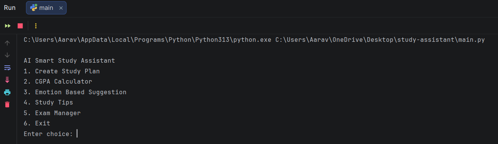
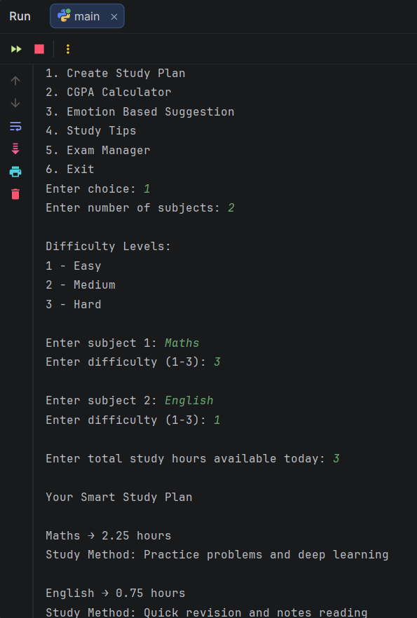
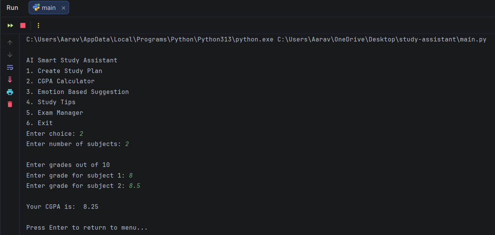
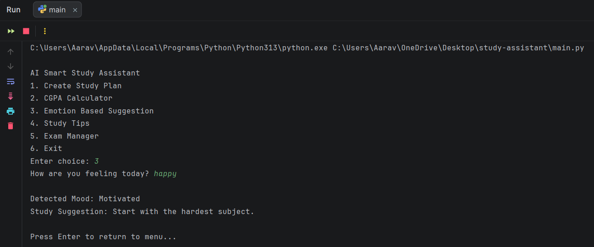
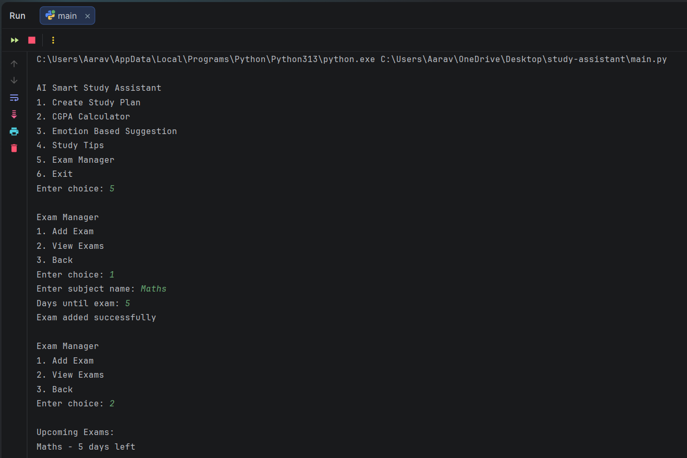
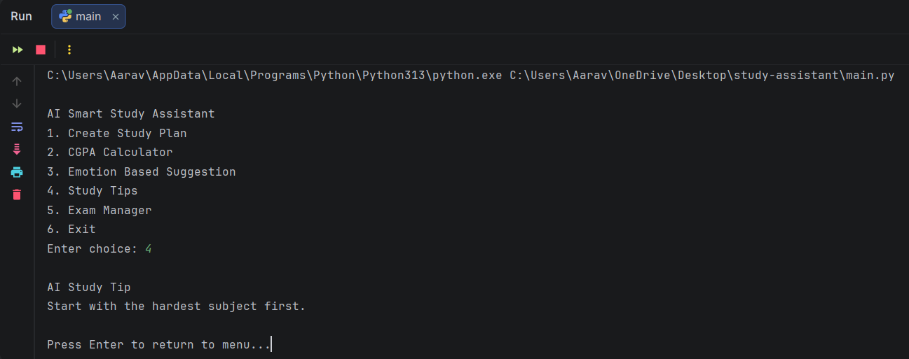

# AI Smart Study Assistant

## Overview:

AI Smart Study Assistant is a command-line based application designed to help students plan their studies more effectively. It provides study planning, CGPA calculation, exam tracking, mood-based suggestions, and productivity tips.

This project solves real-world problems that students face such as:

* Difficulty in planning studies
* Tracking exams
* Monitoring academic performance
* Maintaining productivity and motivation

---

## Features:

### Smart Study Planner

* Generate study plan based on subject difficulty
* Get recommended study methods

### CGPA Calculator

* Calculate CGPA based on subject grades

### Exam Manager

* Add upcoming exams
* Track remaining days
* View all upcoming exams

### Emotion-Based Study Suggestion

* Detect mood
* Suggest suitable study method

### AI Study Tips

* Random productivity tips
* Improve study habits

---

## Project Structure:

```
study-assistant
│
├── screenshots
│   ├── menu.png
│   ├── planner.png
│   ├── cgpa.png
│   ├── emotion.png
│   ├── exam.png
│   └── tips.png
│
├── main.py
├── planner.py
├── cgpa.py
├── emotion.py
├── tips.py
├── exam.py
├── reportfile.pdf
└── README.md
```

---

## Requirements:

* Python 3.x
* No external libraries required

---

## How to Run:

### 1. Clone the repository

```
git clone https://github.com/Aim2339/study-assistant.git
```

### 2. Navigate to folder

```
cd study-assistant
```

### 3. Run the program

```
python main.py
```

---

## How to Use:

### Main Menu



---

### Smart Study Planner



---

### CGPA Calculator



---

### Emotion-Based Suggestion



---

### Exam Manager



---

### Study Tips



---

## Technologies Used:

* Python3: Programming Language
* PyCharm: Code Editor
* Git, GitHub and GitKraken: Version Control
---

## Made by:

* Student Name: Aarav Sciju  
* Registration number: 25BCE10099  
* Course: Fundamentals in AI and ML  
